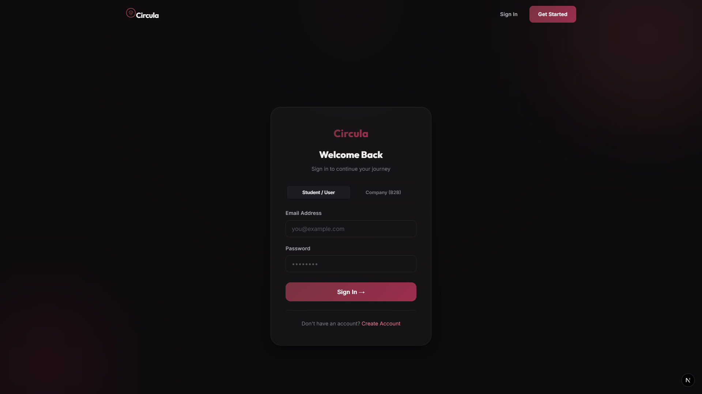

<div align="center">
  
</div>

# Circula 🌐

> **The Next-Generation Bounty Platform with a Real-World Monetary Business Model.**

Circula is a modern, full-stack web application designed to connect companies with skilled talent through a sophisticated bounty system. It features a complete financial pipeline, robust administrative dashboards, and a sleek, dynamic user interface.

<div align="center">
  
</div>

##  Features

- ** Company Portals:** Dedicated portals for companies to post, manage, and delete bounties.
- ** Real-World Economy:** A fully integrated financial system handling fiat balances, payouts, and a robust 35% commission-based revenue model.
- ** Admin Revenue Dashboard:** Comprehensive tracking of platform revenue, commissions, and overall financial integrity.
- ** Premium UI/UX:** Built with a beautiful dark mode aesthetic, vibrant neon accents, and smooth glassmorphism effects.
- ** Secure Architecture:** A scalable Express.js backend integrated seamlessly with a Next.js frontend.

##  Tech Stack

### Frontend (Client)
- **Framework:** [Next.js](https://nextjs.org/) (App Router)
- **Styling:** Custom Vanilla CSS with modern variables & theme-aware properties
- **Architecture:** React Components, API integration layer

### Backend (Server)
- **Framework:** Node.js with [Express.js](https://expressjs.com/)
- **Database:** MongoDB via [Mongoose](https://mongoosejs.com/)
- **Authentication:** Custom JWT / Session Management
- **Security:** Middleware layer for protected routes and document uploads

##  Getting Started

### Prerequisites

- [Node.js](https://nodejs.org/) (v18+ recommended)
- [MongoDB](https://www.mongodb.com/) (Local or Atlas instance)

### Installation

1. **Clone the repository:**
   ```bash
   git clone https://github.com/sainandanbose3034/circula.git
   cd circula
   ```

2. **Install Server Dependencies:**
   ```bash
   cd server
   npm install
   ```

3. **Install Client Dependencies:**
   ```bash
   cd ../client
   npm install
   ```

### Configuration

Create a `.env` file in the `server` directory and add your environment variables:

```env
PORT=5000
MONGODB_URI=your_mongodb_connection_string
JWT_SECRET=your_secret_key
```

### Running the App Locally

Start the backend server:
```bash
cd server
npm start
# Server runs on http://localhost:5000
```

Start the frontend client:
```bash
cd client
npm run dev
# Client runs on http://localhost:3000
```

##  Contributing

Contributions, issues, and feature requests are welcome! Feel free to check the [issues page](https://github.com/sainandanbose3034/circula/issues).

##  License

This project is licensed under the MIT License - see the LICENSE file for details.

---

<div align="center">
  <i>Built with ❤️ for the future of work.</i>
</div>
